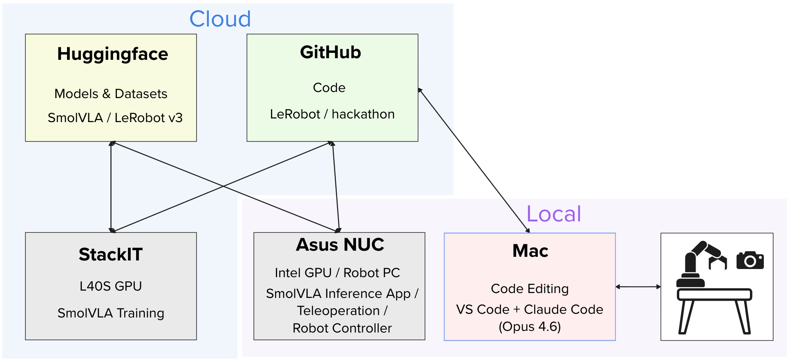
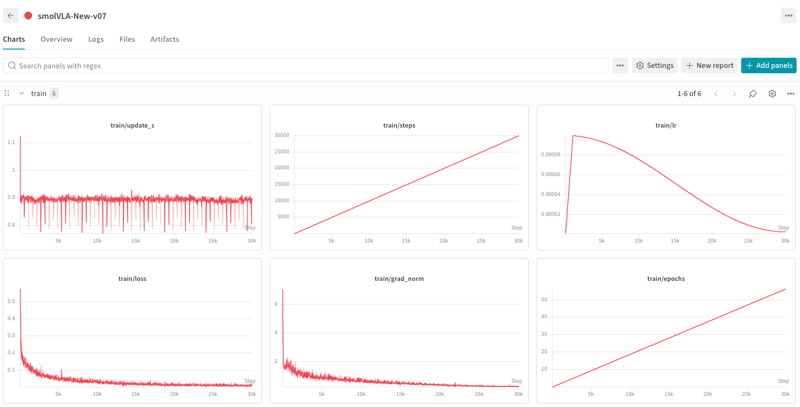
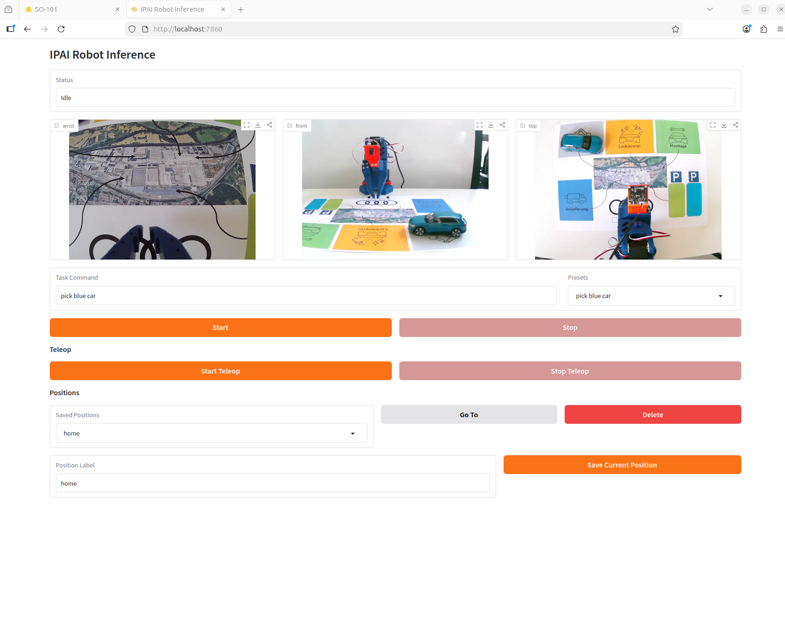

# 🤖 AI & Robotics Hackathon – IPAI Heilbronn

## Members:

- Christoph Spanagel
- Niklas Weidenfeller
- Fabian Baumeister
- Thomas Pröttel
- Lennart Vollmer

## What we built:

We built an AI-driven robotic production system that autonomously handles multi-stage manufacturing tasks in a simulated factory environment. Initially, we trained a pretrained SmolVLA (Vision-Language-Action) model without LoRA, which required approximately 7 hours (overnight) to complete. To improve iteration speed, we then introduced LoRA (Low-Rank Adaptation) for subsequent training runs. By fine-tuning the model using LoRA adapters, we were able to significantly reduce training time to around 1 hour, enabling much faster experimentation and refinement without retraining the full model from scratch.

By recording demonstrations directly on the robot hardware and training with the LeRobot framework, the LoRA-adapted model learned pick and place as well as pushing the car forward. The result is a language-conditioned robot policy that accepts natural language or voice commands and executes multi-stage production tasks autonomously.

## GitHub Folder / Repo:
- Code: https://github.com/chriss2410/ipai-hackathon
- Final dataset: https://huggingface.co/datasets/chris241094/train-v6-merged
- Final models:
    - base: https://huggingface.co/chris241094/smolVLA-New-v07
    - PEFT / LoRa adapter: https://huggingface.co/chris241094/smolVLA-New-lora-v10

## Demo Links & Videos:
https://github.com/chriss2410/ipai-hackathon/tree/main/videos

You’re welcome to upload the video into the Git.

## Key Insights / Learning:

### Setup
- Only the blue car was used during training.
- One wrist camera, two external webcams (top + front). All cameras are 2D cameras (640x480).
- We used blackboard to have a static background

Technical setup:

### Dataset
- With the command *“move car to painting”*, the robot sometimes remained unstable in the starting position.  
  → As a result, significantly more samples with *“pick car”* were included instead of *“move car to painting”*.  
- Subtask creation was considered but not yet implemented.  
- **Multi-task VLA models require balanced datasets.** A single VLA can handle multiple tasks, but with imbalanced data, the model struggles to execute less frequent tasks—especially when start positions are identical across tasks.

### Training
- Used **PEFT / LoRA (Low-Rank Adaptation)** for fine-tuning.  
  → Adds additional parameters but far fewer than training the full network, leading to faster computation.  
- **LoRA significantly reduces training time.** Fine-tuning scaled much better with increasing dataset size compared to full model training.  
- Key parameter: *r* (rank of the new parameter matrix).  
- Fewer training episodes are required since fewer parameters need to be optimized → this leads to time savings.  
- Monitoring LOSS is essential to evaluate whether training is still improving performance.  
- Used *Weights & Biases (wandb.ai)* for training visualization.

### Why a User Interface?
- Simple movements should not require model training and should be directly controllable.
- Functionality of the UI:
    - Teleoperation & saving quick navigation positions
    - Prompt to start tasks

### Problems
- The network was initially executed on the CPU → resulted in jerky movements.  
- Text instructions provided to the model were too brief, limiting performance.
- Only one overnight training session before using LoRa, remaining time after
    initial setup was too short.

### Feedback
- Cool and interesting challenge and setup, but overall too short time after
    initial end-to-end setup
- Lots of follow-up ideas that we couldn't realize in the given time, but could
    be further explored
- Awesome hardware- and software preparation & support

## 🙌 Notes

* One submission per team is enough
* Bullet points are totally fine
* Imperfect demos are welcome
* This becomes part of our shared knowledge
